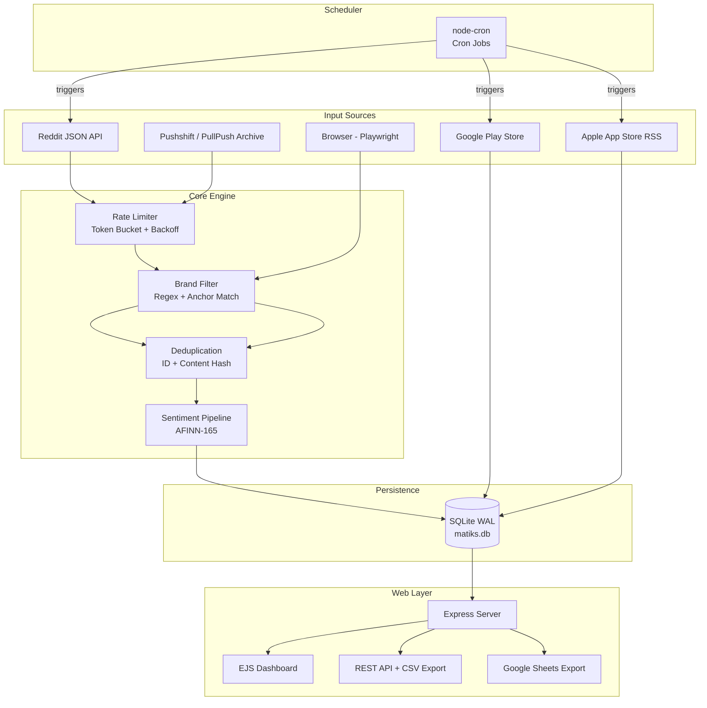

# Matiks Social Media Monitor — Interview Tech Guide

> A comprehensive breakdown of tech stack, system design, architecture decisions, and engineering rationale for the **Matiks Social Media Monitoring Tool**.

---

## 1. Project Overview

**Matiks Monitor** is a production-grade, self-hosted brand intelligence platform. It autonomously scrapes brand mentions from **Reddit**, aggregates app reviews from the **Google Play Store** and **Apple App Store**, runs **local sentiment analysis**, and surfaces everything through a real-time **web dashboard**.

**Key constraints that drove design:**
- No official platform APIs (Reddit public JSON, RSS feeds)
- No cloud infrastructure — runs entirely on Node.js locally
- No account bans / legal risk (Twitter/LinkedIn explicitly excluded)
- Must handle incremental data without re-scraping everything each time

---

## 2. Full Tech Stack

| Layer | Technology | Why |
|---|---|---|
| **Language** | TypeScript 5.4 (ESM) | Type safety, modern async/await, great Node.js ecosystem |
| **Runtime** | Node.js 20+ | Native ESM, stable Fetch API, LTS support |
| **Dev Runner** | `tsx watch` | Zero-config TS execution, hot reload for development |
| **Build** | `tsc` | Compile to `dist/` for production use via `node dist/index.js` |
| **Web Framework** | Express.js 4 | Lightweight, minimal, widely understood |
| **Templating** | EJS | Server-side rendering, no frontend build step; avoids React overhead |
| **Database** | SQLite (better-sqlite3) | Zero-config, file-based, synchronous API = simpler code, WAL mode for concurrency |
| **Browser Automation** | Playwright (Chromium) | Faster than Puppeteer, built-in stealth surface, better async API |
| **Stealth Layer** | `playwright-extra` + `puppeteer-extra-plugin-stealth` | Erases automation fingerprints that sites detect |
| **Sentiment Analysis** | `sentiment` (AFINN-165 lexicon) | Fully offline, no API cost, extensible with custom lexicons |
| **Scheduling** | `node-cron` | Standard cron expressions, lightweight, process-level |
| **Logging** | `winston` | Structured JSON logs, multi-transport (console + file) |
| **HTTP Client** | Native `fetch` (Node 20) | No extra dependency; axios used for Play Store library |
| **Schema Validation** | `zod` | Runtime validation of environment config at startup |
| **Google Sheets** | `google-spreadsheet` + `googleapis` | One-click export to Google Sheets for stakeholders |
| **App Review Scraping** | `google-play-scraper` | npm library wrapping Play Store's internal JSON API |
| **Testing** | `vitest` | Vite-native, fast unit tests |

---

## 3. System Architecture

### High-Level Data Flow



### Project Directory Structure

```
matiks-monitor/
├── src/
│   ├── config.ts               # Central config + zod env validation
│   ├── index.ts                # Entry point: starts server + scheduler
│   ├── core/
│   │   ├── browser.ts          # Playwright singleton + stealth context factory
│   │   ├── rateLimit.ts        # Token-bucket rate limiter (global)
│   │   ├── brandFilter.ts      # Brand anchor matching + exclusion regex
│   │   ├── humanize.ts         # Human behavior simulation (typing, scrolling)
│   │   ├── googleSheets.ts     # Google Sheets API integration
│   │   └── logger.ts           # Winston logger (console + file)
│   ├── scrapers/
│   │   ├── reddit.ts           # 5-phase Reddit scraper (primary)
│   │   ├── playstore.ts        # Play Store review scraper
│   │   ├── appstore.ts         # App Store RSS scraper
│   │   └── run.ts              # CLI entry for manual scrape runs
│   ├── pipeline/
│   │   ├── sentiment.ts        # AFINN analysis + normalization
│   │   └── lexicon.ts          # Custom social media vocabulary overrides
│   ├── db/
│   │   ├── schema.ts           # SQLite schema + WAL init
│   │   ├── queries.ts          # All DB queries (read/write)
│   │   └── init.ts             # DB bootstrap script
│   └── web/
│       ├── server.ts           # Express app, routes, API endpoints
│       ├── views/              # EJS templates (dashboard, mentions, reviews, logs)
│       └── public/             # CSS, client-side JS, assets
├── data/matiks.db              # SQLite database file
├── logs/app.log                # Winston log file
├── cookies/                    # Per-platform Playwright cookie store
└── .env                        # Runtime configuration
```

---

## 4. Module Deep-Dives

### 4.1 Configuration System (`config.ts` + `zod`)

All runtime parameters are parsed from `.env` at startup using **Zod schemas**. The app fails fast with a clear error message if required variables are missing or malformed.

Key config groups:
- **Brand filters** — `SEARCH_TERMS`, `BRAND_REQUIRED_TERMS`, `BRAND_STRICT`, `BRAND_BALANCED`
- **Cron schedules** — `REDDIT_CRON`, `PLAYSTORE_CRON`, `APPSTORE_CRON`
- **App IDs** — `PLAYSTORE_APP_ID`, `APPSTORE_APP_ID`
- **Browser** — `HEADLESS`, `SLOWMO`, proxy settings
- **Google integration** — `GOOGLE_SHEETS_ENABLED`, `GOOGLE_SERVICE_ACCOUNT_JSON`, `GOOGLE_SPREADSHEET_ID`

**Design rationale:** Centralizing config validation in one place prevents silent failures from misconfiguration.

---

### 4.2 Reddit Scraper — 5-Phase Architecture (`reddit.ts`)

The Reddit scraper is the most sophisticated module. It uses a **multi-phase, exhaustive strategy** to ensure no mention is missed.

| Phase | Method | What it does |
|---|---|---|
| **Phase 0** | `reddit.com/r/{sub}` listings | Fetches ALL posts + comments in brand-owned subreddits (e.g., `r/matiks`) |
| **Phase 1** | `reddit.com/search.json` | Exhaustive keyword combinations × sort modes × time filters × pagination |
| **Phase 2** | Per-subreddit restricted search | Searches 30+ targeted subreddits (math, androidapps, edu, India) |
| **Phase 3** | Comment-specific search (`type=comment`) | Catches brand mentions buried in comment threads |
| **Phase 4** | Pushshift/PullPush archive API | Retrieves historical data (skipped in incremental runs) |
| **Phase 5** | Playwright browser verification | Visual scroll + DOM extraction as a final cross-check |

**Incremental vs. Full mode:** The scraper checks `scrape_cursors` table. If a cursor exists, it runs phases 0-3 only with narrow time filters (`day`/`week`), completing in ~5 minutes instead of 10.

**Search term expansion:**
```
"matiks" → "matiks app", "matiks.in", "matiks game", "matiks mental math", 
"matiks duel", "matiks streak", "matiks android", "matik app", "matics app" ...
(30+ combinations)
```

---

### 4.3 Rate Limiting — Token Bucket Algorithm (`rateLimit.ts`)

The system implements a **Token Bucket** with **exponential backoff** per platform:

```
┌─────────────────────────────────────────────────┐
│ Token Bucket (per platform)                     │
│  maxTokens: 10                                  │
│  refillRate: rpm / 60 tokens/sec                │
│  backoffMultiplier: 1x → 10x (on failures)     │
│                                                 │
│  Request → consume 1 token                      │
│  If tokens < 1 → wait (tokensNeeded/rate) ms   │
│  + random jitter (500–2000ms per request)       │
│                                                 │
│  On HTTP 429 → drain tokens + multiply backoff  │
│  On success  → backoff *= 0.9 (slowly recover)  │
└─────────────────────────────────────────────────┘
```

The Reddit scraper uses its **own embedded** `ProductionRateLimiter` class set at **25 req/min** (conservative), with a separate global `rateLimit.ts` for the Play Store and App Store scrapers.

**Key design choice:** Jitter (random delay 500–1500ms per request) prevents the system from looking like a bot with perfectly regular request intervals.

---

### 4.4 Anti-Detection & Browser Stealth (`browser.ts`)

Playwright launches Chromium with every known bot-detection bypass:

**Chrome flags:**
```
--disable-blink-features=AutomationControlled
--disable-dev-shm-usage
--no-sandbox
--disable-gpu
```

**Context-level spoofing (injected into every page):**
- `navigator.webdriver` → `undefined` (hides Selenium/Playwright flag)
- `navigator.plugins` → fake array of 5 plugins
- `navigator.platform` → randomized `Win32` or `MacIntel`
- `navigator.hardwareConcurrency` → random from `[4, 8, 12, 16]`
- `navigator.deviceMemory` → random `4` or `8`
- `window.chrome.runtime` → stub object
- `permissions.query` notifications → bypass

**Randomization per session:**
- Viewport from 4 common HD resolutions (random pick)
- User-Agent from 4 real browser strings (random pick)
- Timezone fixed to `America/New_York`
- Geolocation: New York City

**Cookie persistence:** Session cookies are saved to `cookies/{platform}.json` and reloaded on the next launch, maintaining session continuity.

---

### 4.5 Brand Filter (`brandFilter.ts`)

A multi-strategy relevance system protects data quality:

**Strategy 1 — Strict Mode (BRAND_STRICT=true):**
Only saves content containing at least one brand anchor (e.g., `matiks.in`, `matiks.com`, `matiks app`).

**Strategy 2 — Balanced Mode (BRAND_BALANCED=true):**
Keeps mentions with "matiks" if they also contain app context keywords (`app`, `game`, `math`, `android`, `ios`, `download`, `puzzle`, `duel`...).

**Exclusion patterns (regex):**
- Filipino language terms (high noise — "matik" slang in Tagalog)
- Basketball slang (`matik dribble`, `matik shot`)
- Tattoo artists (`Matt Matik`)
- Counter-Strike terms
- Anime/Japanese names
- Filipino university names

This is critical for the Matiks brand because "matik" is a common Tagalog word, causing massive false-positive noise without these filters.

---

### 4.6 Sentiment Analysis Pipeline (`pipeline/`)

The sentiment engine runs **100% locally** with zero API cost:

1. **Library:** `sentiment` npm package (AFINN-165 word list)
2. **Custom lexicon:** `lexicon.ts` overrides/extends AFINN with social media terms (`"love"`, `"bug"`, `"crash"`, `"amazing"`, `"terrible"`, etc.)
3. **Normalization:** Raw `result.comparative` (average score per word) → clamped to `[-1, 1]`
4. **Labels:**
   - `score >= 0.1` → **positive**
   - `score <= -0.1` → **negative**
   - else → **neutral**
5. **Confidence heuristic:** `min(1, |score| + tokens.length × 0.05)` — longer texts with strong signals score higher confidence

Every mention and review is tagged at scrape time. The dashboard can filter by sentiment label in real time.

---

### 4.7 Database Design (`schema.ts`)

SQLite with **WAL (Write-Ahead Logging)** mode for concurrent read/write without locking.

#### Core Tables

**`mentions`** — Reddit posts and comments
```sql
id, platform_id, external_id (UNIQUE), author, author_url,
content, url, engagement_likes, engagement_comments, engagement_shares,
sentiment_score, sentiment_label, created_at, scraped_at
```

**`reviews`** — Play Store & App Store reviews
```sql
id, platform_id, external_id (UNIQUE), author, rating, title, content,
app_version, helpful_count, developer_reply,
sentiment_score, sentiment_label, review_date, scraped_at
```

**`scrape_cursors`** — Incremental scraping state
```sql
platform (PK), last_scraped_at, last_item_date, last_item_ids, updated_at
```

**`scrape_logs`** — Job audit trail
```sql
id, platform, status, items_found, items_new, error, started_at, completed_at
```

**Outreach tables** (compliance-first Reddit posting helper):
- `outreach_reddit_auth` — OAuth token store
- `outreach_subreddits` — target subreddits + cooldown settings
- `outreach_drafts` — draft posts for human review before submission
- `outreach_post_attempts` — audit log of post attempts

#### Indexes
```sql
idx_mentions_platform, idx_mentions_created, idx_mentions_sentiment
idx_reviews_platform, idx_reviews_date, idx_reviews_rating
```

**Design rationale:** SQLite was chosen because the system runs locally, data volumes are in the thousands-to-hundreds-of-thousands range (not millions), and a file-based DB eliminates server setup completely. WAL mode handles the concurrency between the web server (readers) and scheduler (writers).

---

### 4.8 Scheduler (`jobs.ts`)

Jobs are registered as an array of `ScheduledJob` objects and started with `node-cron`:

```typescript
// Concurrency guard — prevents overlap if a job runs long
if (runningJobs.has(job.name)) {
  logger.warn(`Skipping ${job.name} (previous run still active)`);
  return;
}
```

| Job | Default Cron | Guard |
|---|---|---|
| Reddit Scraper | `0 */4 * * *` (every 4h) | Always enabled |
| Play Store | `0 */6 * * *` (every 6h) | Only if `PLAYSTORE_APP_ID` set |
| App Store | `0 */6 * * *` (every 6h) | Only if `APPSTORE_APP_ID` set |

**Graceful shutdown:** `SIGINT`/`SIGTERM` handlers close the browser before exiting.

---

### 4.9 Web Server & API (`server.ts`)

A standard Express.js app with server-side rendering via EJS templates.

#### Pages (SSR)
| Route | Template | Data |
|---|---|---|
| `GET /` | `dashboard.ejs` | Stats, recent mentions, recent reviews, logs |
| `GET /mentions` | `mentions.ejs` | Filtered `mentions` table (search, date, platform, sentiment) |
| `GET /reviews` | `reviews.ejs` | Filtered `reviews` table |
| `GET /logs` | `logs.ejs` | Last 100 `scrape_logs` |

#### REST API
| Endpoint | Method | Description |
|---|---|---|
| `/api/stats` | GET | Aggregate counts, averages |
| `/api/mentions` | GET | Paginated JSON list with filters |
| `/api/reviews` | GET | Paginated JSON list with filters |
| `/api/status` | GET | Uptime, cron schedules, rate limit states, recent logs |
| `/api/export/mentions` | GET | Download as CSV |
| `/api/export/reviews` | GET | Download as CSV |
| `/api/export/sheets?type=mentions` | GET | Push to Google Sheets |
| `/api/export/sheets?type=reviews` | GET | Push to Google Sheets |

**URL-based filtering:** All filters use query params (`?platform=reddit&sentiment=negative&search=bug`). This makes filtered views shareable by copying the URL.

---

## 5. Key Design Decisions & Trade-offs

### Why SQLite over PostgreSQL?
- Zero infrastructure: just a file → perfect for an MVP running locally
- `better-sqlite3`'s **synchronous API** avoids async complexity for DB reads in Express route handlers
- WAL mode handles the write contention between scraper (writer) and web server (reader)
- Trade-off: doesn't horizontally scale, but this is intentional for local-first design

### Why Playwright over Puppeteer or Selenium?
- **Built-in stealth base**: Chromium args + script injection is cleaner
- **Better async API**: `page.evaluate()`, `waitFor*` methods are more reliable
- **Single binary**: Playwright manages its own Chromium download (`npx playwright install chromium`)
- Trade-off: larger download size

### Why EJS over React/Vue?
- No build pipeline → simpler deployment
- Data already available server-side from SQLite → no API round-trip for initial page load
- The dashboard is read-only → no complex state management needed
- Trade-off: no reactive UI; page refreshes are required

### Why no Twitter or LinkedIn?
- **Twitter/X**: Strict auth requirements, aggressive bot detection, DCMA/ToS legal risk, CycleTLS complexity on macOS
- **LinkedIn**: Extremely aggressive scraping blocks, account at risk, no meaningful public data endpoint
- This is a deliberate product decision, not a technical limitation

### Why no API keys for Reddit?
- Reddit's public JSON API (`/search.json`, `/r/sub/new.json`) is accessible with a browser User-Agent
- Avoids OAuth app registration, rate limit quotas, and credential management complexity
- Trade-off: lower rate limits (25 req/min vs. 60 for OAuth apps)

---

## 6. Data Quality Strategy

The system uses a **three-layer funnel** to ensure only relevant, non-duplicate data enters the database:

```
Raw API Results
      │
      ▼
┌─────────────────────┐
│  Layer 1: ID Dedup  │  Set<string> of seen `external_ids`
│  + Content Hash     │  Prevents duplicates across phases/API calls
└──────────┬──────────┘
           │
           ▼
┌─────────────────────┐
│  Layer 2: Brand     │  Strict anchor | Balanced keyword | Subreddit allowlist
│  Filter             │  Removes false positives (Tagalog, tattoos, CS:GO...)
└──────────┬──────────┘
           │
           ▼
┌─────────────────────┐
│  Layer 3: DB UNIQUE │  `UNIQUE(platform_id, external_id)` — final DB-level guard
│  constraint         │  `INSERT OR IGNORE` pattern
└─────────────────────┘
           │
           ▼
     Sentiment tagging → Store in SQLite
```

---

## 7. Scraper Safety Features

| Feature | Implementation |
|---|---|
| **Time-boxing** | Each scraper run has a max wall-clock time (10 min full, 5 min incremental) |
| **Buffer flushing** | Every 25 items flushed to DB → no data loss on crash |
| **Graceful degradation** | If a phase fails, scraper continues to next phase |
| **Retry with backoff** | `withRetry(fn, {maxRetries: 3, baseDelay: 1000, maxDelay: 30000})` |
| **Jitter** | Random 500–1500ms delay per request |
| **User-Agent rotation** | 5 real browser UA strings rotated per request |
| **Proxy support** | HTTPS + SOCKS5 proxies configurable in `.env` |
| **Cookie session** | Playwright saves/restores cookies between runs |

---

## 8. Interview Talking Points

### On architecture choices:
> "I chose a monolithic, single-process architecture intentionally for this MVP. It eliminates network hops between services, simplifies deployment to just `npm start`, and is appropriate for expected data volumes. If this were to scale, I'd extract the scraper into a separate worker process communicating via a message queue."

### On the scraping strategy:
> "The Reddit scraper runs five distinct phases to maximize coverage — from the public JSON API to browser-based visual verification. The key insight is using a cursor-based incremental system: once we've done a full historical scrape, subsequent runs only look at fresh data, completing in 5 minutes instead of 10."

### On anti-bot measures:
> "Bot detection works by correlating signals — perfect request timing, missing browser APIs, known automation flags. I address this by randomizing everything: viewport, user agent, hardware specs, request timing (jitter), and patching every `navigator.*` property that headless browsers expose."

### On data quality:
> "The biggest challenge with 'matiks' is that it's also a common Tagalog slang word and appears in Counter-Strike and tattoo contexts. I built a multi-layer brand filter with 10+ exclusion regex patterns that eliminate noise, combined with a balanced mode that requires the word to co-occur with app context keywords like 'download', 'android', 'puzzle'."

### On the token bucket rate limiter:
> "Token bucket is the right algorithm here because it allows short bursts (filling queued requests quickly) while maintaining a long-term average. Exponential backoff on 429 responses is standard practice — double the wait on each failure, slowly recover on success."

### On SQLite with WAL:
> "SQLite in WAL mode allows concurrent reads from multiple connections while a writer is active, which is exactly my access pattern: the Express server is constantly reading while the scheduler periodically writes. WAL also improves write performance by making writes sequential to the log file."

---

## 9. Potential Improvements (For Discussion)

| Area | Improvement |
|---|---|
| **Scalability** | Replace SQLite with PostgreSQL, move scraper to a worker thread or separate process |
| **Queue** | Add BullMQ for job queue with retries, dead-letter, and UI visibility |
| **Real-time UI** | Add WebSocket to push new mentions live (no page refresh needed) |
| **LLM Sentiment** | Replace AFINN with an LLM-backed sentiment classifier for higher accuracy |
| **Alerting** | Slack/email webhook when sentiment spikes negative or volume spikes |
| **Containerization** | Docker Compose with Chromium in headless container for reproducible deployment |
| **More platforms** | YouTube comments, App Store search suggestions, Google News |
| **Auth** | Basic auth on the dashboard to protect sensitive brand data |
